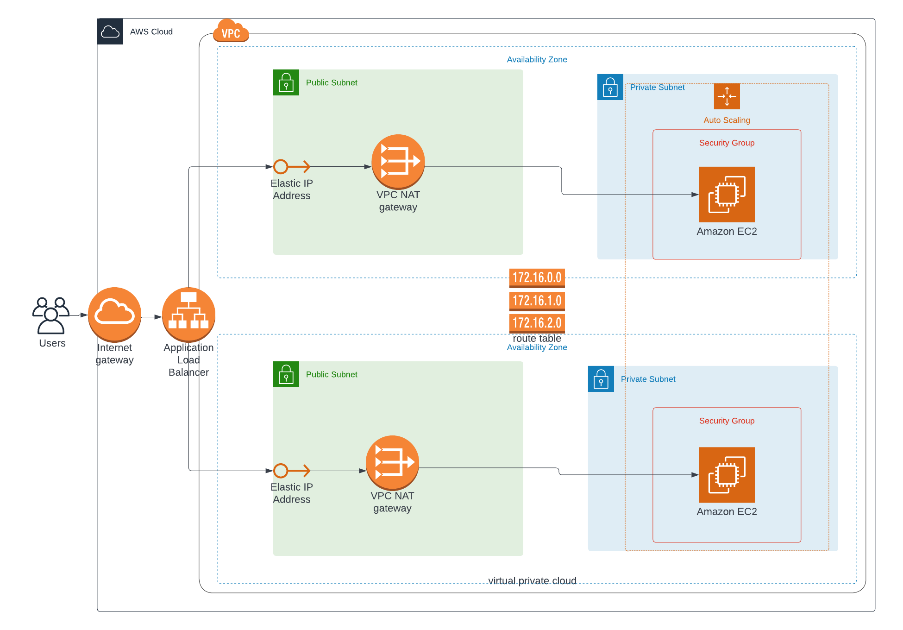

# Udacity *Advanced Cloud DevOps Nanodegree Program*
## Project 2 : Deploy a high-availability web app using CloudFormation
This project deploys web servers for a highly available web app using CloudFormation.
It creates and deploys the infrastructure and application for an Instagram-like app from the ground up.
Deployment begins with the networking components, followed by servers, security roles and software.
The application code is deployed from the S3 bucket using appropriate role.

### Description
Create a Launch Configuration in order to deploy four servers, two located in each of your private subnets.
The launch configuration will be used by an auto-scaling group.
You'll need two vCPUs and at least 4GB of RAM. The Operating System to be used is Ubuntu 18.
So, choose an Instance size and Machine Image (AMI) that best fits this spec.
Be sure to allocate at least 10GB of disk space so that you don't run into issues.

### Architecture Diagram

